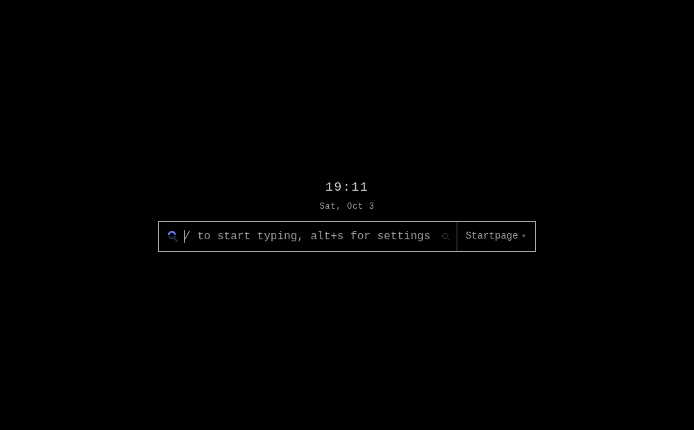

<div align="center">
  
  <h1>Yawn</h1>
  <p><b>A minimal new tab page for Firefox: engines, bangs, favourites, a clock. No network, no tracking.</b></p>
  <p>
    <a href="manifest.json"></a>
    <a href="LICENSE"></a>
  </p>
</div>

---

`yawn` replaces Firefox's new tab page through `chrome_url_overrides.newtab`. One `index.html`, one stylesheet and
one ES module: no bundler, no framework, no backend, no build step.



## Install

Release Firefox only installs signed add-ons, so pick one:

```sh
# for the session: about:debugging#/runtime/this-firefox -> Load Temporary Add-on -> manifest.json

# or sign it yourself - free, and the unlisted channel skips review - then install the .xpi from about:addons
npx web-ext sign --api-key ... --api-secret ... --channel unlisted
```

Unsigned works on Nightly, Developer Edition and ESR: set `xpinstall.signatures.required = false` and copy the folder
to `<profile>/extensions/yawn@extension.local/`.

Installing it also sets the homepage to the page itself, so the startup tab - which loads the homepage, not
`about:newtab` - is Yawn too. Firefox lists that under Settings, Home as an extension-controlled homepage and you can
take it back there.

## Use

- Type and press `Enter` to search with the preferred engine.
- `!g linux` searches through that engine once; `!g` on its own switches to it.
- `/` focuses the search box, `alt+s` opens settings, `esc` backs out.
- Favourites are tiles: add, edit, delete, drag to reorder (or `ctrl` + arrows). Firefox's top sites seed them once.
- Typing suggests sites from your top sites, and from your history once you grant that permission.
- 15 settings: layout, clock, light mode, following the browser theme, transparent background.

## Privacy

No requests beyond its own files, no telemetry, no remote fonts and no remote favicons - a tile shows the favicon
Firefox already has for the site (`data:` urls out of `topSites`, nothing is fetched) and a letter when it has none.
The optional history permission is only read for those suggestions, and settings and favourites live in
`localStorage` and nowhere else.

## Development

```sh
# load it: about:debugging#/runtime/this-firefox -> Load Temporary Add-on -> manifest.json
# web-ext run cannot do that anymore: it drives Firefox over CDP, which Firefox 141 dropped
node --test test/    # unit tests for lib.js
npx web-ext lint     # must stay at 0 errors
```

## License

MIT - see [LICENSE](LICENSE).
